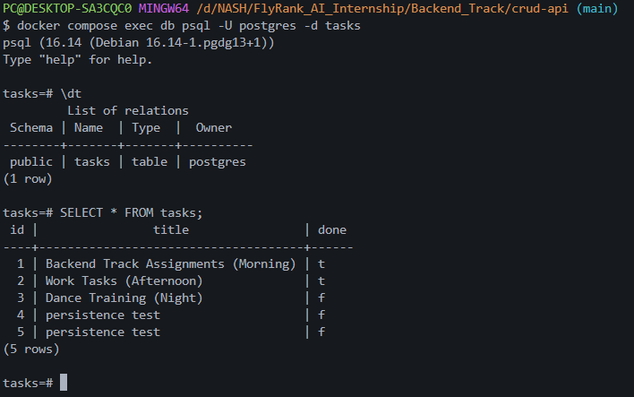

# Task API

A CRUD API for managing a to-do list, built with Node.js, Express, and PostgreSQL,
running fully containerized via Docker Compose.

## Stack

- Node.js + Express
- PostgreSQL 16 (containerized)
- Docker Compose (app + database, one command)

## Run it

    cp .env.example .env
    docker compose up

That's it — no local Node install, no local Postgres install. `docker compose up`
builds the app image, starts Postgres, creates the `tasks` table if it doesn't exist,
and seeds three example tasks on first run only.

Server: http://localhost:3000
Swagger UI: http://localhost:3000/docs

## Configuration

Copy `.env.example` to `.env` before running. Variables:

| Variable            | Meaning                                                                                                              |
|---------------------|----------------------------------------------------------------------------------------------------------------------|
| `PORT`              | Port the app listens on (default 3000)                                                                               |
| `DATABASE_URL`      | Postgres connection string (used by the app)                                                                         |
| `POSTGRES_PASSWORD` | Postgres password (used by `compose.yaml` to configure the `db` service — must match the password in `DATABASE_URL`) |

`.env` is git-ignored — never commit real credentials. `.env.example` holds
placeholder values so anyone cloning the repo knows which keys to set.

## Endpoints

| Method | Path          | Description         |
|--------|---------------|---------------------|
| GET    | /             | API info            |
| GET    | /health       | Health check        |
| GET    | /tasks        | List all tasks      |
| GET    | /tasks/:id    | Get a single task   |
| POST   | /tasks        | Create a task       |
| PUT    | /tasks/:id    | Update a task       |
| DELETE | /tasks/:id    | Delete a task       |

## Example request

    $ curl -i -X POST http://localhost:3000/tasks -H "Content-Type: application/json" -d '{"title":"Buy milk"}'

    HTTP/1.1 201 Created
    Content-Type: application/json

    {"id":4,"title":"Buy milk","done":false}

## Persistence

Task data lives in a Postgres container backed by a named Docker volume
(`taskdata`). Data survives `docker compose down` and a later `docker compose up`
— the volume outlives the containers. It's only lost if you explicitly run
`docker compose down -v`.

## Exploring the database directly

    docker compose exec db psql -U postgres -d tasks

Then, inside psql:

    \dt
    SELECT * FROM tasks;

## Swagger UI

