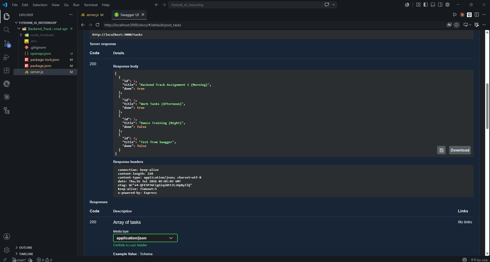

# Task API

A minimal CRUD API for managing a to-do list, built with Node.js and Express. In-memory storage — no database, data resets on server restart.

## Install & Run

npm install
npm start

Server runs on http://localhost:3000. Swagger UI docs at http://localhost:3000/docs.

## Endpoints

| Method | Path          | Description         |
|--------|---------------|---------------------|
| GET    | /             | API info            |
| GET    | /health       | Health check        |
| GET    | /tasks        | List all tasks      |
| GET    | /tasks/:id    | Get a single task   |
| POST   | /tasks        | Create a task       |
| PUT    | /tasks/:id    | Update a task       |
| DELETE | /tasks/:id    | Delete a task       |

## Example request

$ curl -i -X POST http://localhost:3000/tasks -H "Content-Type: application/json" -d '{"title":"Buy milk"}'
HTTP/1.1 201 Created
X-Powered-By: Express
Content-Type: application/json; charset=utf-8
Content-Length: 40
ETag: W/"28-PpSBYV7i68cXyGc7AhjVpkZkY5Q"
Date: Thu, 16 Jul 2026 04:04:21 GMT
Connection: keep-alive
Keep-Alive: timeout=5

{"id":4,"title":"Buy milk","done":false}

## Swagger UI

