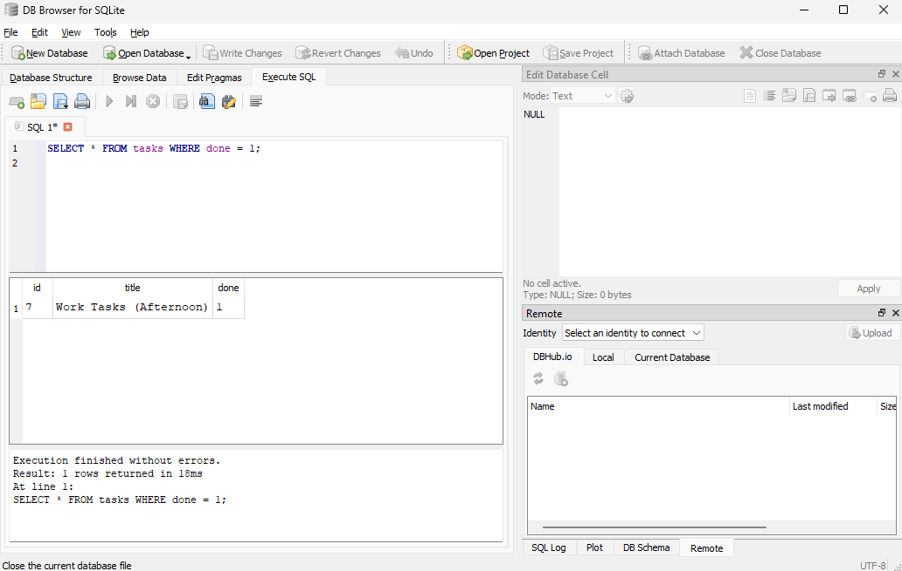

# Task API

A minimal CRUD API for managing a to-do list, built with Node.js, Express, and SQLite.

## Why SQLite

SQLite requires no separate database server — the entire database lives in a single file
(`tasks.db`) in the project root. That makes it appropriate for a single-instance learning
project: zero setup, zero configuration, and no extra process to run alongside the API.

## Where the database lives

`tasks.db` is created automatically in the project root the first time the server starts.
It is not committed to the repository (see `.gitignore`) — each clone generates its own file
and seeds it with 3 example tasks on first run.

## Install & Run

npm install
npm start

Server runs on http://localhost:3000. Swagger UI docs at http://localhost:3000/docs.

## Endpoints

| Method | Path          | Description         |
|--------|---------------|---------------------|
| GET    | /             | API info            |
| GET    | /health       | Health check        |
| GET    | /tasks        | List all tasks      |
| GET    | /tasks/:id    | Get a single task   |
| POST   | /tasks        | Create a task       |
| PUT    | /tasks/:id    | Update a task       |
| DELETE | /tasks/:id    | Delete a task       |

Data now persists across restarts — killing and restarting the server no longer clears tasks.

## Example request

$ curl.exe -X POST http://localhost:3000/tasks -H "Content-Type: application/json" -d '{"title":"Buy milk"}'

{"id":4,"title":"Buy milk","done":false}

## Exploring the database directly

Opened `tasks.db` in DB Browser for SQLite and ran, among others:

    SELECT * FROM tasks WHERE done = 1;

Any changes made this way are immediately reflected by the API on the next request — the
API has no in-memory cache of its own; it queries the database fresh every time.

## Swagger UI

