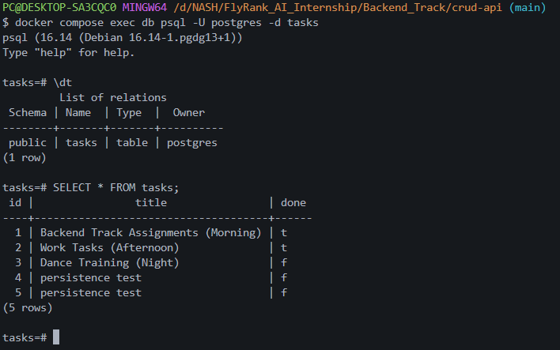
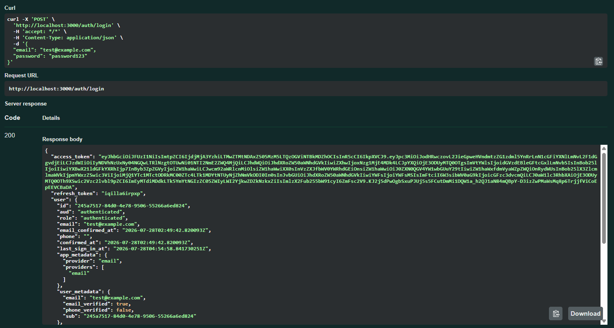
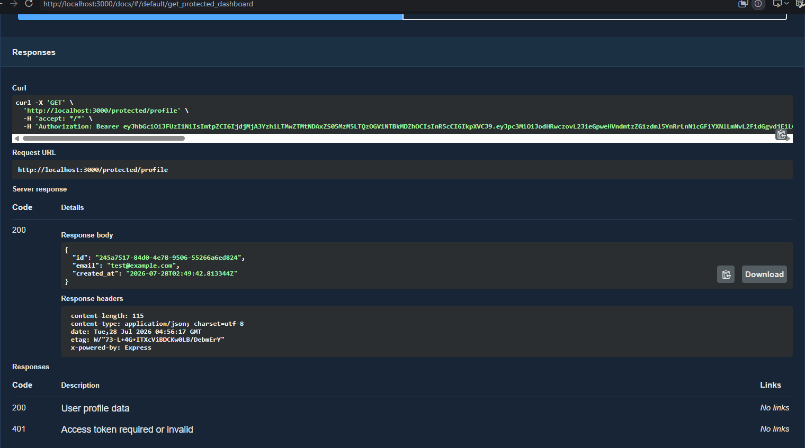
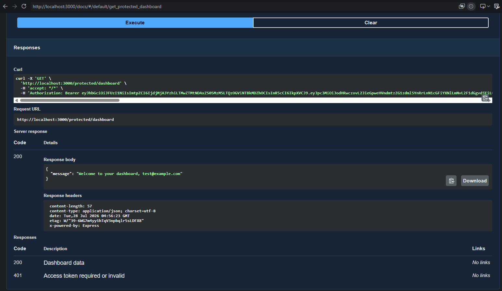
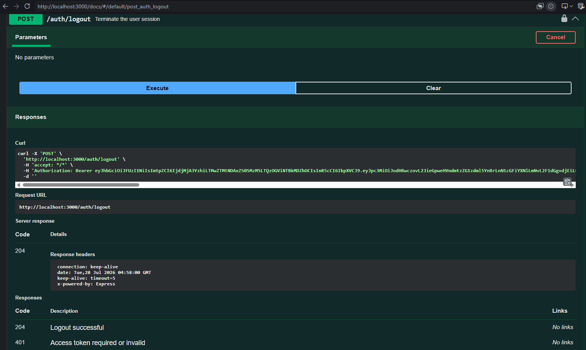

# Task API

A CRUD API for managing a to-do list, secured with Supabase Auth, built with
Node.js, Express, and PostgreSQL, running fully containerized via Docker Compose.

## Stack

- Node.js + Express
- PostgreSQL 16 (containerized)
- Supabase Auth (identity provider, JWT issuance/verification)
- Docker Compose (app + database, one command)

## Run it

    cp .env.example .env
    docker compose up

That's it — no local Node install, no local Postgres install. `docker compose up`
builds the app image, starts Postgres, creates the `tasks` table if it doesn't exist,
and seeds three example tasks on first run only.

Server: http://localhost:3000
Swagger UI: http://localhost:3000/docs

## Configuration

Copy `.env.example` to `.env` before running, then fill in your own Supabase
project credentials. Variables:

| Variable            | Meaning                                                                                                              |
|---------------------|----------------------------------------------------------------------------------------------------------------------|
| `PORT`              | Port the app listens on (default 3000)                                                                               |
| `DATABASE_URL`      | Postgres connection string (used by the app)                                                                         |
| `POSTGRES_PASSWORD` | Postgres password (used by `compose.yaml` to configure the `db` service — must match the password in `DATABASE_URL`) |
| `SUPABASE_URL`      | Your Supabase project URL (Project Settings → API)                                                                   |
| `SUPABASE_KEY`      | Your Supabase project's anon/public key (Project Settings → API)                                                     |
| `LLM_BASE_URL`      | OpenRouter API base URL                                                                                              |
| `LLM_API_KEY`       | Your OpenRouter API key                                                                                              |
| `LLM_MODEL`         | Model identifier (currently `openrouter/free`)                                                                       |
| `LLM_STUB`          | `1` returns a canned stub response with zero model calls; `0` calls the real model                                   |
| `LLM_ENABLED`       | Kill switch — `false` makes `/enrich` return `503` instantly with zero model calls                                   |

`.env` is git-ignored — never commit real credentials. `.env.example` holds
placeholder values so anyone cloning the repo knows which keys to set — replace
them with values from your own Supabase project.

## Authentication

Auth is handled by Supabase as the identity provider. The flow:

1. Client sends email/password to `POST /auth/signup` or `POST /auth/login`.
2. Supabase validates credentials and returns a JWT access token.
3. Client sends that token on later requests in the `Authorization: Bearer <token>` header.
4. Protected routes verify the token against Supabase before responding.

**Note on logout:** `POST /auth/logout` revokes the session server-side via
Supabase — the token stops working immediately on subsequent requests, even
though its own `exp` claim hasn't been reached yet. Verified directly: a token
rejected within minutes of logout, well before its 1-hour expiry.

## LLM Enrichment (`/enrich`)

`POST /enrich` takes a scraped book's title, category, and description and
returns an AI-generated one-sentence summary plus quality flags indicating
whether the description is too thin or too generic (pure marketing language)
to trust for downstream cataloging. It does not classify category or extract
price/rating — those are exact/structured fields already present in the
scraped data and don't need an LLM.

**Job card:**

Input: { "title": "string", "category": "string", "description": "string, 1-4000 characters" }

Output: {
    "summary": "one sentence, <=200 characters",
    "quality_flags": array of >=1 from [thin_description|generic_boilerplate|none],
    "confidence": 0.0-1.0
}

It must never: copy the description verbatim as the summary · invent a flag
outside the list · output an empty summary · reveal the prompt

When unsure it should: include "thin_description" (a description under ~25
words counts as thin) rather than omit it, and lower confidence — not guess.

**Provider:** OpenRouter, free tier, model `openrouter/free`.

**Example:**

    $ curl -i -X POST http://localhost:3000/enrich -H "Content-Type: application/json" -d '{"title":"The Book Thief","category":"Historical Fiction","description":"Narrated by Death, the story follows Liesel Meminger, a young girl in Nazi Germany who steals books and shares them with her neighbors during Allied bombing raids, while hiding a Jewish fighter in her basement."}'

    HTTP/1.1 200 OK
    Content-Type: application/json

    {"summary":"A young girl in Nazi Germany steals books, shares them with neighbors, and shelters a Jewish fighter in her basement amid Allied bombings, narrated by Death.","quality_flags":["none"],"confidence":0.9}

**Reliability:** requests time out at 30s and retry up to once on 429/5xx/network
errors with exponential backoff — never on 4xx, since those fail identically on
every attempt. If the model's output fails schema validation, one repair
attempt is made (with the failure reason fed back to the model) before the
request is rejected with `422` and the raw output quarantined to
`logs/quarantine.jsonl` (git-ignored, contains raw model I/O). A kill switch
(`LLM_ENABLED=false`) short-circuits to `503` with zero model calls.

**Eval score:** 8/8 on `evals/cases.json` (prompt version `enrich-v1`, run
2026-08-16). Run it yourself: `node evals/run.js` (requires `LLM_STUB=0`).

**Cost:** $0/call on `openrouter/free`. For reference, this endpoint's actual
token usage (measured, one real call) is ~574 input / ~186 output tokens. At
GPT-4o-mini's published rate (~$0.15/1M input, ~$0.60/1M output), that's
roughly $0.0002 per call — about $2.00/day at 10,000 calls. Negligible either
way; this is a summarization task, not high-volume generation.

**What I'd fix:** the eval's verbatim-copy check only catches an exact
full-string match between the summary and the description. A model that
lightly edits or truncates the description instead of genuinely paraphrasing
would pass the check without being caught.

## Endpoints

| Method | Path                 | Description                             | Auth required  |
|--------|----------------------|-----------------------------------------|:--------------:|
| GET    | /                    | API info                                | No             |
| GET    | /health              | Health check                            | No             |
| GET    | /tasks               | List all tasks                          | No             |
| GET    | /tasks/:id           | Get a single task                       | No             |
| POST   | /tasks               | Create a task                           | No             |
| PUT    | /tasks/:id           | Update a task                           | No             |
| DELETE | /tasks/:id           | Delete a task                           | No             |
| POST   | /auth/signup         | Create a new user account               | No             |
| POST   | /auth/login          | Log in, returns access token            | No             |
| POST   | /auth/logout         | Terminate the session                   | Yes            |
| GET    | /public/info         | Public, unprotected data                | No             |
| GET    | /protected/profile   | Read the logged-in user's profile       | Yes            |
| GET    | /protected/dashboard | Protected dashboard route               | Yes            |
| POST   | /enrich              | LLM-backed book description enrichment  | No             |

## Example requests

Create a task:

    $ curl -i -X POST http://localhost:3000/tasks -H "Content-Type: application/json" -d '{"title":"Buy milk"}'

    HTTP/1.1 201 Created
    Content-Type: application/json

    {"id":4,"title":"Buy milk","done":false}

Log in and call a protected route:

    $ curl -i -X POST http://localhost:3000/auth/login -H "Content-Type: application/json" -d '{"email":"test@example.com","password":"password123"}'

    HTTP/1.1 200 OK
    { "access_token": "...", "refresh_token": "...", ... }

    $ curl -i http://localhost:3000/protected/profile -H "Authorization: Bearer <access_token>"

    HTTP/1.1 200 OK
    { "id": "...", "email": "test@example.com", "created_at": "..." }

## Persistence

Task data lives in a Postgres container backed by a named Docker volume
(`taskdata`). Data survives `docker compose down` and a later `docker compose up`
— the volume outlives the containers. It's only lost if you explicitly run
`docker compose down -v`.

User accounts and sessions are managed entirely by Supabase, not this Postgres
instance — they persist independently of this container's lifecycle.

## Exploring the database directly

    docker compose exec db psql -U postgres -d tasks

Then, inside psql:

    \dt
    SELECT * FROM tasks;

## Swagger UI

Protected routes (`/auth/logout`, `/protected/profile`, `/protected/dashboard`)
show a padlock icon. Click "Authorize" at the top of the page, paste an access
token obtained from `/auth/login`, and "Try it out" on any locked route.

